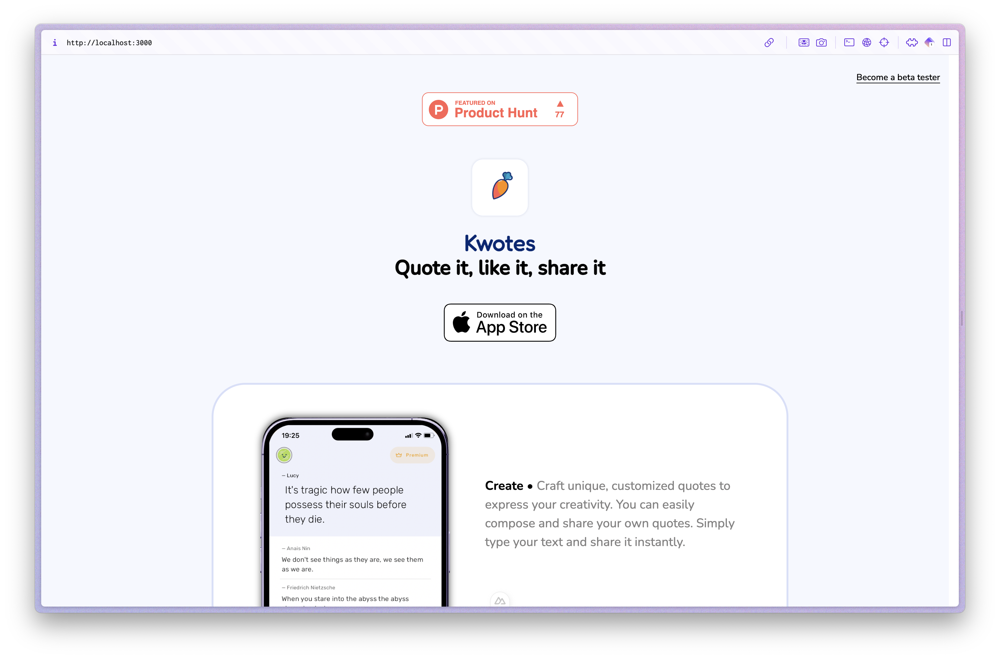

# Kwotes.fr

> Quote it, like it, share it.

<a href="https://kwotes.fr" target="_blank">Kwotes</a> landing page.

<p align="middle">
  
</p>

## What is Kwotes?

Kwotes is a captivating mobile application that offers a vast collection of inspiring, thought-provoking, and insightful quotes from a diverse range of sources. Designed to be a constant companion for users, kwotes provides a seamless and engaging experience, allowing individuals to explore, save, and share their favorite quotes with ease.

Key features:

• Extensive Quote Library: kwotes boasts an extensive database of quotes, covering a wide range of topics, including motivation, personal growth, leadership, love, and more. Users can browse through the collection, discover new and inspiring quotes, and save their favorites for easy access.

• Personalized Experience: The app allows users to customize their experience by creating personalized collections, categorizing quotes based on their interests, and setting daily quote reminders to start their day on a positive note.

• Share and Inspire: kwotes makes it easy for users to share their favorite quotes with friends, family, and social media followers. With built-in sharing capabilities, users can spread the inspiration and connect with like-minded individuals.

• Beautifully Designed: The app boasts a visually appealing and user-friendly interface, with clean and modern design elements that enhance the overall experience. The app's layout and navigation are intuitive, making it easy for users to explore and discover new quotes.

• Search for specific references: We allow users to seek for specific topics, themes, authors or references depending of your mood. Get a bit of fun or a breath of wisdom.

• Thought-Provoking Insights: In addition to the quote library, kwotes provides users with thought-provoking insights and reflections, encouraging them to delve deeper into the meaning and significance of the quotes they encounter.


## Setup
<details>
<summary><b>Quick start</b></summary>

Make sure to install the dependencies:

```bash
# npm
npm install

# bun
bun install
```

### Development Server

Start the development server on `http://localhost:3000`:

```bash
# npm
npm run dev

# bun
bun run dev
```

### Production

Build the application for production:

```bash
# npm
npm run build

# bun
bun run build
```

Locally preview production build:

```bash
# npm
npm run preview

# bun
bun run preview
```

</details>

## Credits

This project uses [Nuxt](https://nuxt.com/docs/getting-started/introduction) and [Nuxt UI](https://ui.nuxt.com).

## License

Mozilla Public License Version 2.0

